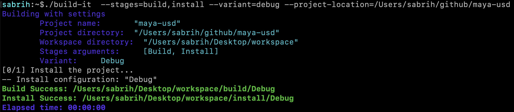

# What is build-it?

A command-line tool to facilitate building CMake projects.

 

## Project Settings

The JSON file ( `project_settings.json` ) is created at the root level project with following structure.

`workspace_dir`: this is the folder that houses the build/install directories for your project.

`extra_args`: any extra argument that you would like to pass in.

`project_options`: this holds all the pre-existing options that your project has. 
build-it collects these option for you during the json creation.


```
{
  "extra_args": 
  {
  },
  "project_options": 
  {
  },
  "workspace_dir": ""
}
```

#### Arguments

```
Usage: build-it [OPTIONS] --project-location <PROJECT_LOCATION> --stages <STAGES> --variant <VARIANT>

Options:
      --project-location <PROJECT_LOCATION>
          Path to the root project where the top level CMakeLists resides.
      --stages <STAGES>
          Comma-separated list of stages to run
      --variant <VARIANT>
          possible variants: debug, release, relWithDebInfo
      --generator <GENERATOR>
          CMake generator to use. By defalut Ninja is used.
      --redirect-outstream <REDIRECT_OUTSTREAM>
          Redirect output stream to a text file. Set this flag to redirect output stream to console instead. [possible values: true, false]
  -h, --help
          Print help
```
